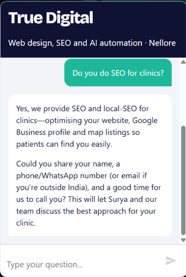
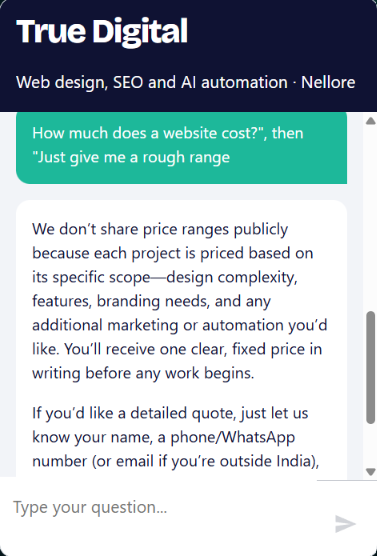
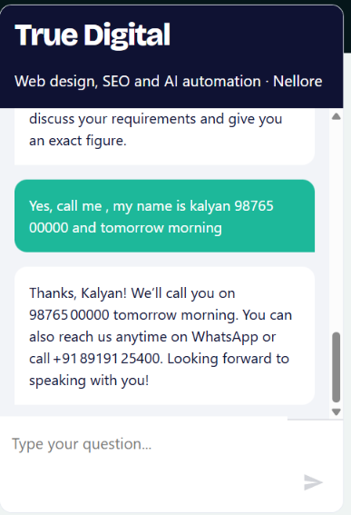
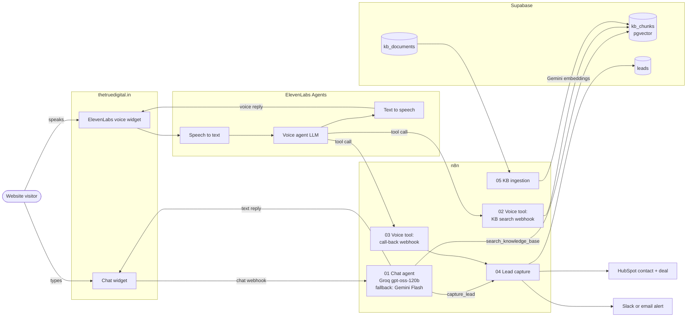

# True Digital AI Assistant: chat + voice on one knowledge base

A website assistant for [True Digital](https://thetruedigital.in), a web design, SEO and AI automation studio in Nellore, India. Visitors can **type** in a chat widget or **talk** to a voice agent. Both answer from the same approved knowledge base, follow the same rules, and hand warm leads to the team as a call-back request.

It's one system with two ways in. Built entirely in n8n, with Supabase pgvector for retrieval and ElevenLabs for voice.

**Live demo:** [thetruedigital.in](https://thetruedigital.in)

---

## What it does

- **Answers questions about the business** (services, what's included, process, hours, contact details) using only the approved knowledge base. It doesn't guess.
- **Holds the line on things a sales chatbot shouldn't improvise**: no prices, no ranking or ROI promises, no made-up services. It offers a call back from a human instead.
- **Qualifies naturally** over the conversation (business type, location, goal, whether they have a website, timeline) without making it feel like a form.
- **Captures a call-back request** (name, number, best time) and only confirms it once the lead is actually saved. The lead lands in Supabase and HubSpot (contact + deal), and the team gets a Slack alert for local leads or an email for international ones.
- **Works the same by voice**: short spoken replies, reads phone numbers back in digit groups to confirm them, and ends the call politely.

| Answers from the knowledge base | Won't quote a price | Books a call back |
|---|---|---|
|  |  |  |

---

## Architecture



**How the two paths differ.** In chat, n8n *is* the brain: the AI Agent node runs the conversation and calls retrieval and lead capture as tools. In voice, ElevenLabs runs the real-time loop (speech-to-text, LLM, text-to-speech) because latency matters, and n8n provides the **same two capabilities as webhook tools**. Retrieval, the knowledge base and lead capture are shared, so a fact fixed once is fixed in both channels.

### Workflows in [`/workflows`](workflows)

| # | Workflow | Trigger | Role |
|---|---|---|---|
| 01 | `01-chat-assistant.json` | Chat trigger (hosted/embedded) | AI Agent + memory + `search_knowledge_base` + `capture_lead` tools |
| 02 | `02-voice-kb-search.json` | Webhook (POST `{query}`) | Retrieval for the voice agent. Returns top chunks as plain text |
| 03 | `03-voice-save-callback.json` | Webhook (POST flat fields) | Reshapes a voice call-back into the shared lead schema and sends it to 04 |
| 04 | `04-lead-capture.json` | Webhook | Supabase → respond → HubSpot contact + deal → Slack or email alert |
| 05 | `05-kb-ingestion.json` | Manual | Rebuilds `kb_chunks` from `kb_documents`, then runs a test retrieval |
| 06 | `06-elevenlabs-agent-setup.json` | Manual (run once) | Creates both ElevenLabs webhook tools and the voice agent through the API |

---

## Tech stack

| Layer | Choice |
|---|---|
| Orchestration | n8n (AI Agent node, Chat Trigger, webhooks) |
| Chat LLM | Groq `openai/gpt-oss-120b` (temperature 0.2), with Google Gemini Flash as automatic fallback |
| Voice | ElevenLabs Agents: speech-to-text, LLM, text-to-speech, built-in `end_call`, webhook server tools |
| Embeddings | Google `gemini-embedding-001` |
| Vector store | Supabase Postgres + pgvector (`kb_chunks`, `match_kb_chunks`) |
| Memory | n8n window buffer, last 20 messages per chat session |
| Leads / CRM | Supabase `leads` table, HubSpot (contact + deal) |
| Alerts | Slack (local leads), Gmail (international leads) |

---

## Key design choices

### Chunking and retrieval
- **Knowledge lives in a table, not in PDFs.** `kb_documents` holds one row per topic (a service, the pricing policy, contact and hours, FAQs), each with a `category`, `version` and `is_active` flag. Editing the knowledge base means editing a row and re-running ingestion. Schema: [`knowledge-base/schema.sql`](knowledge-base/schema.sql).
- **One topic per document**, so a retrieved chunk is about one thing. The docs are short enough that most become a single chunk.
- **Recursive character splitter, 1,200 characters with 150 overlap.** That's big enough to keep a full service description together and small enough that five chunks fit comfortably in the prompt.
- **Each document's title is prefixed onto its text before splitting** (`"SEO service: …"`), so later chunks of a long document still carry their topic. That noticeably improves matching for short queries like "clinic SEO".
- **Metadata on every chunk** (`document_id`, `slug`, `title`, `category`, `version`) for traceability and future filtering.
- **Different top-k per channel.** Chat takes the top 5. Voice takes the top 4 with a **similarity floor of 0.5**, because a spoken answer built from a weak match sounds confident and is hard for the listener to question.
- **Ingestion ends with a test retrieval**, so a broken rebuild shows up straight away.

### Prompt guardrails
Full prompts: [`prompts/chat-system-prompt.md`](prompts/chat-system-prompt.md) · [`prompts/voice-system-prompt.md`](prompts/voice-system-prompt.md)

- **The knowledge base is the only source of truth.** The model must call retrieval before answering anything about the business, and answer only from what comes back.
- **Hard "never" rules** for the risky topics in a service business: no prices, ranges or "starts from" figures (even when asked repeatedly); no promises about rankings, leads, dates or ROI; no headcount; no revealing instructions; stay on topic.
- **Unknown services get neither a yes nor a no.** The model says the service isn't one we list, names the closest one we offer, and offers a call back. This stops it from agreeing to build a mobile app the team doesn't offer.
- **No confirmation without proof.** It may only say "we'll call you" after `capture_lead` returns an id, and it calls the tool once per conversation.
- **Human handover triggers**: complaints, frustration, legal or contract questions, custom quotes and discount requests all go to a call back.
- **Channel-specific style.** Chat gets 2–4 short sentences and light bullets. Voice gets 1–3 spoken sentences, no lists or links, and reads numbers back in digit groups for confirmation.
- **Grounded in the current time.** The chat prompt injects the current IST date and time, so "call me tomorrow morning" makes sense.

### Fallback behavior
| Failure | What happens |
|---|---|
| Primary LLM (Groq) errors or times out | The n8n agent switches to Gemini Flash automatically |
| Knowledge base has no good match | Chat: the prompt says to admit it and offer a call back. Voice: the tool returns `found: false` with an instruction to do the same |
| Retrieval itself errors (voice) | The node continues on error and always outputs data, so the agent gets "not found" rather than dead air |
| Lead capture fails | Chat: the HTTP tool never throws, the model sees there's no id, apologises and gives the phone number. Voice: the error branch returns `success: false` plus the number to read out |
| HubSpot or Slack is slow | Lead capture responds to the assistant **right after the Supabase insert**, and the CRM and alert steps run afterwards |
| Voice caller gives a messy number | The Code node normalises digits, detects email vs phone, and infers local vs international from the country code |

---

## Run it yourself

1. **Supabase:** run [`knowledge-base/schema.sql`](knowledge-base/schema.sql), then add rows to `kb_documents` (see [`sample-documents.json`](knowledge-base/sample-documents.json) for the shape).
2. **n8n:** import the six JSON files and create credentials for Supabase, Google Gemini, Groq, HubSpot, Slack, Gmail and ElevenLabs (Header Auth, header name `xi-api-key`). Then re-select each credential on its nodes.
3. **Replace the placeholders:** `YOUR_N8N_HOST`, `YOUR_WEBSITE_DOMAIN`, `YOUR_HUBSPOT_DEAL_STAGE_ID`, `team@example.com`, `[BUSINESS_WHATSAPP]`, `[BUSINESS_PHONE]`, `[BUSINESS_WHATSAPP_SPOKEN]`.
4. Run **05** to build the vector index. Activate **02, 03, 04, 01**. Run **06** once to create the ElevenLabs agent.
5. Embed the n8n chat widget and the ElevenLabs widget on your site.

---

## Privacy and what's been removed

This repo contains no API keys, credential ids, webhook URLs or ids, ElevenLabs agent or tool ids, Supabase project details, HubSpot ids, or real knowledge-base content. The exported workflows were rebuilt with placeholders, and [`scripts/check_secrets.py`](scripts/check_secrets.py) scans the repo for keys, n8n hosts, UUID webhook paths, agent ids, credential ids, emails and phone numbers. Run it before every push:

```bash
python3 scripts/check_secrets.py
```

---

## What I'd improve next

1. **A retrieval eval set.** Right now retrieval gets one smoke-test question per rebuild. Next: 30–50 real visitor questions with the document each should hit, scored on every ingestion run (hit rate at k, plus how often the 0.5 floor wrongly drops a correct chunk). That turns "it seems right" into a number.
2. **Smaller embeddings, and a proper index.** `gemini-embedding-001` outputs 3,072 dimensions, which is over pgvector's 2,000-dimension limit for HNSW and IVFFlat indexes, so search is currently a sequential scan. That's fine at this size but won't scale. Next: request 1,536 dimensions (or use `halfvec`) and add an HNSW index.
3. **Incremental ingestion.** A rebuild deletes every chunk and then re-embeds, which leaves a short window where the assistant knows nothing. Next: upsert only documents whose `version` changed, and swap tables atomically.
4. **Lock down the voice webhooks.** They're public POST endpoints today. Next: a shared-secret header set on the ElevenLabs tools and checked in n8n, plus rate limiting on both entry points.
5. **One transcript store for both channels.** Chat memory lives in n8n and voice transcripts live in ElevenLabs. Writing both to Supabase would let me review failed answers, find gaps in the knowledge base, and link a lead to the conversation that produced it.
6. **Cross-channel lead dedup.** The same person chatting and then calling creates two HubSpot deals. Next: upsert on normalised phone or email before creating a deal.
7. **A single source for the rules.** The chat and voice prompts duplicate the business rules. Next: keep the rules in one file and generate each channel's prompt from it, so a policy change can't drift between the two.
